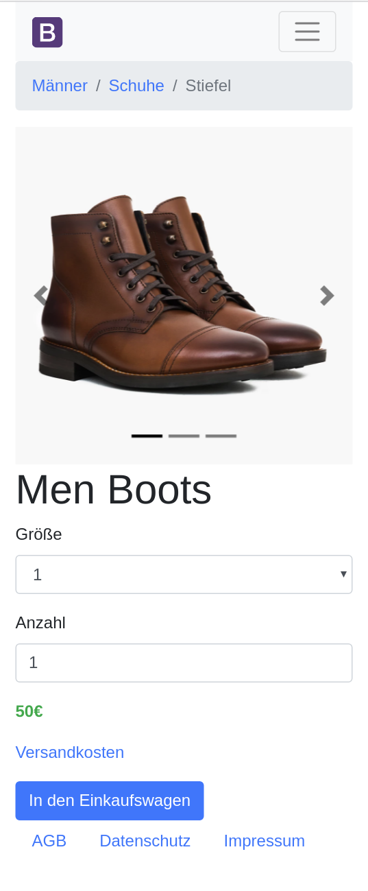
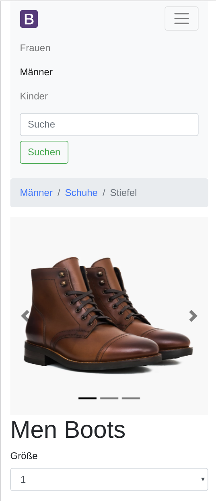
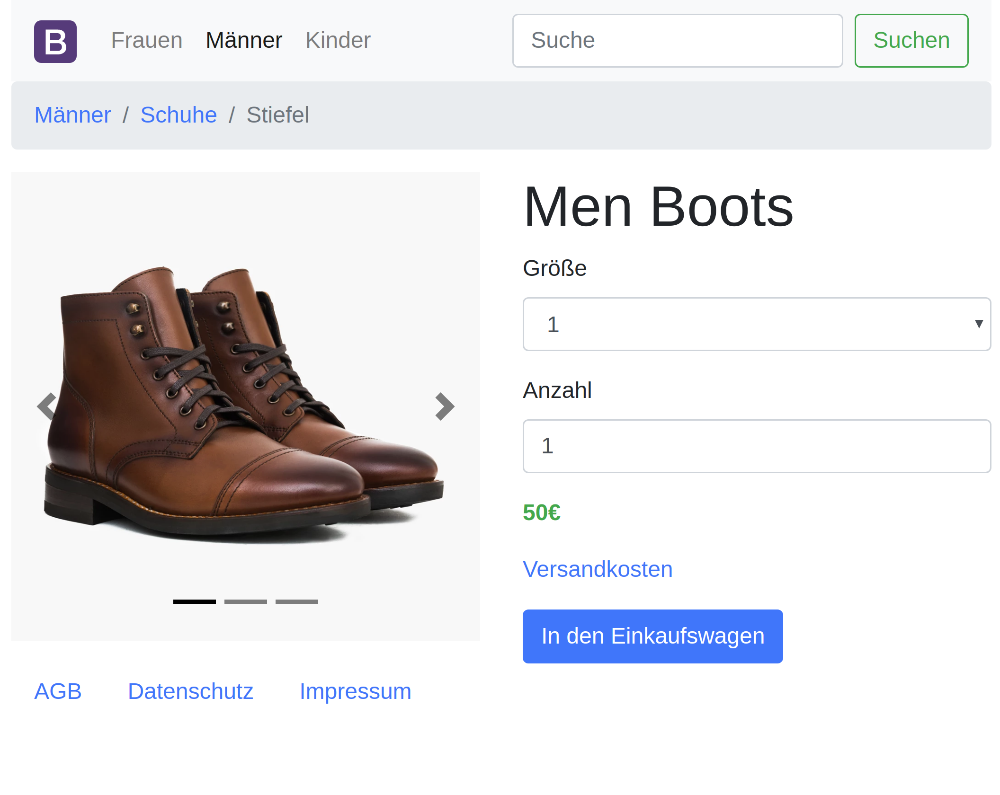

# Bootshop
Baue eine Shop-Seite mit Bootstrap!

Pass die Seite folgendermaßen über Bootstrap-Variablen an:
- primary-Farbe: #78c2ad
- secondary-Farbe: #f3969a
- heading-Farbe: #5a5a5a
- border-radius: .4rem
- Font für Überschriften: Montserrat, -apple-system, system-ui, BlinkMacSystemFont, "Segoe UI", Roboto, "Helvetica Neue", Arial, sans-serif
- success-Farbe: #56cc9d

## Mobile

## Tablet

## Desktop

